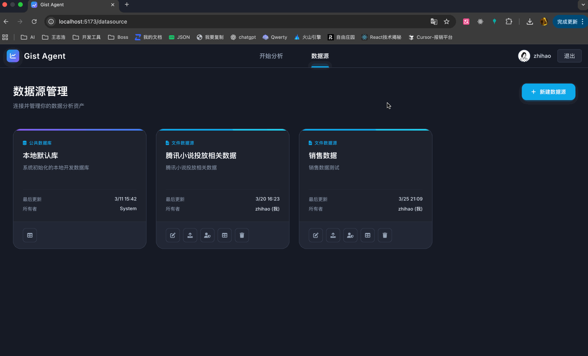
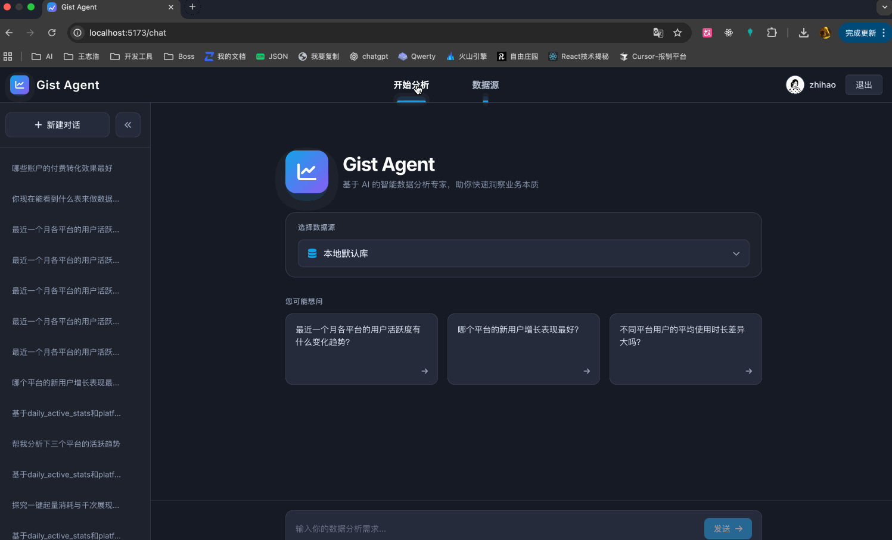

# Gist Agent

> [中文文档](./README.md)

An LLM-powered data analysis platform. Upload CSV/Excel files, ask questions in natural language — the agent generates SQL, executes queries, and renders charts in real time.

---

## Quick Demo

### datasource



### analysis



---

## Architecture Diagram


---

## Features

| Feature | Description |
|---|---|
| **Zero-config data ingestion** | Upload `.csv` / `.xlsx` (multi-sheet selection supported). The server infers schema, deduplicates columns, and creates MySQL tables. Prefers `LOAD DATA LOCAL INFILE` for speed; auto-fallback to batch INSERT on restricted environments. |
| **ReAct agent loop** | Multi-step agent via OpenAI Function Calling: intent parsing -> SQL generation -> error retry -> result analysis -> chart output. 15-iteration cap, 120s global timeout. |
| **AST-based SQL sanitizer** | Every SQL is parsed into an AST via `node-sql-parser`. Whitelist: `SELECT`/`SHOW`/`DESC`/`EXPLAIN` only. `LIMIT 1000` enforced automatically. Table-name scope validation prevents cross-tenant access. |
| **Self-healing SQL executor** | Syntax errors (GROUP BY conflicts, reserved words, etc.) trigger a silent internal LLM rewrite (up to 2 retries). Semantic errors (unknown column, etc.) are surfaced directly to the main agent -- never silently swallowed. 15s per-query timeout circuit breaker. |
| **Schema enrichment** | After table creation, an async task samples 5 rows and asks the LLM to infer field semantics (enums, units, date formats), then writes them back as `COLUMN_COMMENT`. |
| **3-tier memory engine** | Nearby (2 turns): full tool chain (dehydrated). Mid-range (3-6 turns): SQL + row count + conclusion only. Distant (>6 turns): plain-text summary. CJK-aware token estimator adaptively allocates context budget. |
| **Semantic distillation** | After each turn, async extraction of business definitions and data facts, persisted as State JSON. Automatically injected into the system prompt next turn for cross-turn "long-term memory". |
| **Smart suggestions** | Auto-generates 3 business-oriented suggested questions from the data source schema. Auto-refreshes on new table uploads, with caching. |
| **SSE streaming** | Every agent step (reasoning, SQL, data fetch, chart config) is pushed over Server-Sent Events in real time. No polling, no WebSocket. |
| **Multi-tenant isolation** | JWT auth with SMTP-based password recovery. Data sources support fine-grained permission management (grant/revoke). Each user's table space and session history are fully isolated. |
| **LangSmith tracing** | Set `LANGSMITH_API_KEY` to enable full ReAct trace visibility -- tool call chains, token usage, SQL latency. |

---

## Project Structure

```
gist-agent/                  # pnpm workspaces Monorepo
├── server/                  # Backend — NestJS
│   └── src/
│       ├── auth/            # JWT auth, password recovery, guards
│       ├── chat/            # Agent Loop core
│       │   ├── agents/      # Sub-agents (SQL sanitizer, semantic distiller)
│       │   └── tools/       # Function Calling tool registry
│       ├── conversation/    # Conversation & message persistence
│       ├── database/        # MySQL connection pool, schema reader
│       ├── datasource/      # Data source mgmt, file upload, schema enrichment, suggestions
│       ├── llm/             # OpenAI SDK wrapper + LangSmith integration
│       └── user/            # User info
├── web/                     # Frontend — Vue 3 + Vite
│   └── src/
│       ├── components/
│       │   ├── blocks/      # Message block renderers (Markdown / SQL / Table / Chart / Log)
│       │   └── datasource/  # Data source management components
│       ├── stores/          # Pinia state management
│       ├── views/           # Pages (Chat / DataSource / Auth)
│       └── router/          # Routing + auth guards
├── docker-compose.yml
├── DEPLOY.md                # Production deployment guide
└── FAQ.md                   # Architecture design FAQ & ops recipes
```

---

## Tech Stack

Monorepo managed with `pnpm workspaces`.

| Layer | Stack |
|---|---|
| Frontend | Vue 3 (Composition API), Vite, Pinia, ECharts, marked + highlight.js |
| Backend | NestJS, OpenAI Node SDK, mysql2 (Raw SQL), Passport JWT |
| Key libs | `node-sql-parser` (AST), `xlsx` (Excel parsing), `nodemailer` (email), `bcrypt` (password hashing) |
| Observability | LangSmith (optional) |
| Runtime | Node.js >= 18, pnpm >= 8, MySQL >= 5.7 |

---

## Quick Start

### 1. Clone and install

```bash
git clone <your-repo-url>
cd gist-agent
pnpm install
```

### 2. Configure environment

```bash
cp .env.example .env
```

Edit `.env`. Required variables:

| Variable | Required | Description |
|---|---|---|
| `OPENAI_API_KEY` | Yes | LLM API key |
| `OPENAI_BASE_URL` | No | Custom base URL (e.g. for DeepSeek, Qwen) |
| `OPENAI_MODEL` | No | Model name, defaults to `gpt-4o` |
| `DB_HOST` | Yes | MySQL host |
| `DB_PORT` | Yes | MySQL port (default `3306`) |
| `DB_USER` | Yes | MySQL user |
| `DB_PASSWORD` | Yes | MySQL password |
| `DB_NAME` | Yes | Database name |
| `JWT_SECRET` | Yes | Secret for signing JWT tokens |
| `MAX_CONTEXT_TOKENS` | No | LLM context window size, defaults to `32000` |
| `SMTP_HOST` | No | SMTP host for password-recovery emails |
| `SMTP_USER` | No | SMTP sender address |
| `SMTP_PASS` | No | SMTP password / app auth code |
| `LANGSMITH_API_KEY` | No | Enables LangSmith tracing |

### 3. Initialize database

```bash
# Automatically creates the database and all required metadata tables
pnpm run init-db
```

### 4. Start (development)

```bash
# Start both server and frontend
pnpm dev

# Or start individually
pnpm dev:server   # http://localhost:3000
pnpm dev:web      # http://localhost:5173
```

---

## More Resources

- **[FAQ.md](./FAQ.md)** -- Architecture design Q&A (Tool vs Agent boundary, SQL sanitizer internals) and ops recipes (SSH tunnel to production MySQL)
- **[DEPLOY.md](./DEPLOY.md)** -- Docker Compose, Nginx reverse proxy, GitHub Actions CI/CD

---

## License

[MIT](./LICENSE)
