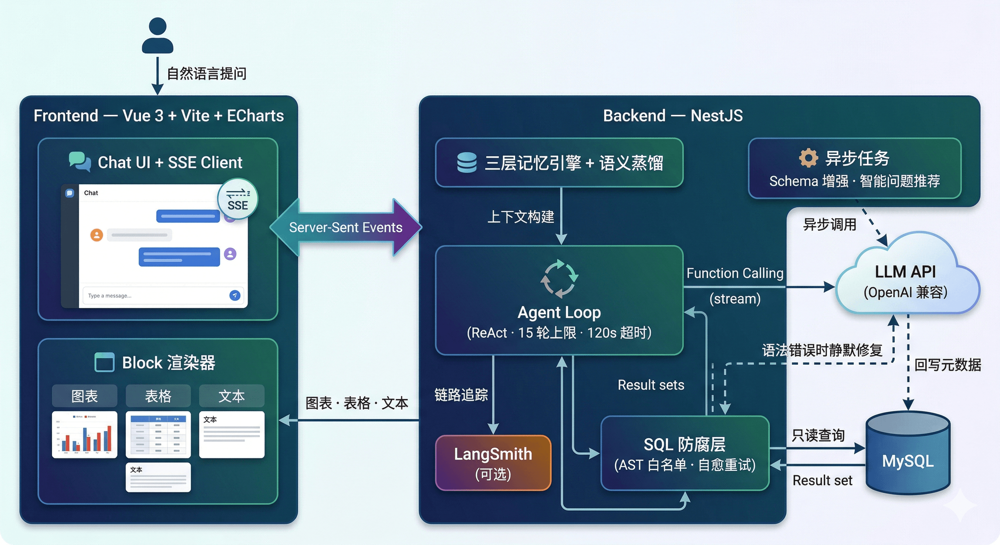

<div align="center">
  

  # Gist Agent

  基于大语言模型（LLM）的智能数据分析平台。上传 CSV / Excel 文件，
  用自然语言提问，Agent 自动生成 SQL、执行查询、实时渲染图表。

  <p>
    
    
    
  </p>

  <p>
    <a href="./README.en.md">English</a> · <b>简体中文</b>
  </p>
</div>


<h2 align="center">项目演示</h2>

<video src="./web/public/ai-analysis-login.mp4" width="100%" controls autoplay muted loop></video>

<video src="./web/public/ai-analysis.mp4" width="100%" controls autoplay muted loop></video>

<video src="./web/public/ai-datasource.mp4" width="100%" controls autoplay muted loop></video>

<h2 align="center">架构图（具体见功能特性）</h2>

<p align="center">
  
</p>


## 功能特性

| 特性 | 说明 |
|---|---|
| **零配置数据接入** | 上传 `.csv` / `.xlsx`（支持多 Sheet 选择），服务端自动推断 Schema、去重列名、建表。首选 `LOAD DATA LOCAL INFILE` 极速写入，云环境自动降级为批量 INSERT。 |
| **ReAct Agent 循环** | 基于 OpenAI Function Calling 的多步 Agent：意图解析 -> SQL 生成 -> 错误重试 -> 结果分析 -> 图表输出。最大 15 轮迭代，120 秒全局超时。 |
| **AST SQL 防腐层** | 每条 SQL 经 `node-sql-parser` 解析为 AST，白名单仅允许 `SELECT`/`SHOW`/`DESC`/`EXPLAIN`，自动注入 `LIMIT 1000`，表名范围校验防越权。 |
| **SQL 自愈执行器** | 纯语法错误（GROUP BY 冲突、保留字等）触发内部 LLM 静默修复（最多 2 次重试）；语义错误（列不存在等）直接暴露给主 Agent，不掩盖。15 秒单次查询超时熔断。 |
| **Schema 自动增强** | 建表后异步采样 5 行真实数据，LLM 推断字段业务语义（枚举值、单位、日期格式），反写 `COLUMN_COMMENT`。 |
| **三层记忆引擎** | 近距（2 轮）保留完整 tool chain（脱水后），中距（3~6 轮）仅保留 SQL + 行数 + 结论，远距（>6 轮）压缩为纯文字摘要。CJK 感知的 Token 估算器自适应分配上下文预算。 |
| **语义蒸馏** | 每轮对话结束后异步提取业务定义和数据事实，持久化为 State JSON，下轮自动注入 System Prompt，实现跨轮次"长期记忆"。 |
| **智能推荐问题** | 基于数据源 Schema 自动生成 3 个业务导向的推荐提问，上传新表后自动刷新，带缓存。 |
| **SSE 流式推送** | Agent 每一步动作（推理、SQL、取数、图表配置）实时通过 Server-Sent Events 推送，无轮询，无 WebSocket。 |
| **多租户隔离** | JWT 认证 + SMTP 密码找回。数据源支持精细权限管理（grant/revoke），不同用户的表空间、会话历史完全隔离。 |
| **LangSmith 追踪** | 配置 `LANGSMITH_API_KEY` 即开启全链路追踪：Tool 调用链、Token 用量、SQL 执行耗时。 |


## 项目结构

```
gist-agent/                  # pnpm workspaces Monorepo
├── server/                  # 后端 — NestJS
│   └── src/
│       ├── auth/            # JWT 认证、密码找回、守卫
│       ├── chat/            # Agent Loop 核心
│       │   ├── agents/      # 子 Agent（SQL 防腐层、语义蒸馏器）
│       │   └── tools/       # Function Calling 工具注册
│       ├── conversation/    # 会话 & 消息持久化
│       ├── database/        # MySQL 连接池、Schema 读取
│       ├── datasource/      # 数据源管理、文件上传、Schema 增强、推荐问题
│       ├── llm/             # OpenAI SDK 封装 + LangSmith 包装
│       └── user/            # 用户信息
├── web/                     # 前端 — Vue 3 + Vite
│   └── src/
│       ├── components/
│       │   ├── blocks/      # 消息区块渲染（Markdown / SQL / Table / Chart / Log）
│       │   └── datasource/  # 数据源管理组件
│       ├── stores/          # Pinia 状态管理
│       ├── views/           # 页面（Chat / DataSource / Auth）
│       └── router/          # 路由 + 鉴权守卫
├── docker-compose.yml
├── DEPLOY.md                # 生产部署指南
└── FAQ.md                   # 架构设计 FAQ & 运维实践
```


## 技术栈

| 层级 | 技术 |
|---|---|
| 前端 | Vue 3（Composition API）、Vite、Pinia、ECharts、marked + highlight.js |
| 后端 | NestJS、OpenAI Node SDK、mysql2（Raw SQL）、Passport JWT |
| 关键依赖 | `node-sql-parser`（AST）、`xlsx`（Excel 解析）、`nodemailer`（邮件）、`bcrypt`（密码哈希） |
| 可观测性 | LangSmith（可选） |
| 运行环境 | Node.js >= 18、pnpm >= 8、MySQL >= 5.7 |


## 快速启动

### 1. 克隆并安装依赖

```bash
git clone <your-repo-url>
cd gist-agent
pnpm install
```

### 2. 配置环境变量

```bash
cp .env.example .env
```

编辑 `.env`，变量说明如下：

| 变量名 | 是否必填 | 说明 |
|---|---|---|
| `OPENAI_API_KEY` | 必填 | LLM API Key |
| `OPENAI_BASE_URL` | 可选 | 自定义 Base URL（如 DeepSeek、Qwen 等兼容服务） |
| `OPENAI_MODEL` | 可选 | 模型名称，默认 `gpt-4o` |
| `DB_HOST` | 必填 | MySQL 地址 |
| `DB_PORT` | 必填 | MySQL 端口，默认 `3306` |
| `DB_USER` | 必填 | MySQL 用户名 |
| `DB_PASSWORD` | 必填 | MySQL 密码 |
| `DB_NAME` | 必填 | 数据库名 |
| `JWT_SECRET` | 必填 | JWT 签名密钥 |
| `MAX_CONTEXT_TOKENS` | 可选 | LLM 上下文窗口大小，默认 `32000` |
| `SMTP_HOST` | 可选 | SMTP 服务地址（用于密码找回邮件） |
| `SMTP_USER` | 可选 | SMTP 发件人地址 |
| `SMTP_PASS` | 可选 | SMTP 密码或授权码 |
| `LANGSMITH_API_KEY` | 可选 | 开启 LangSmith 全链路追踪 |

### 3. 初始化数据库与表结构

```bash
# 执行此命令，服务端将自动创建目标数据库并初始化所有元数据表
pnpm run init-db
```

### 4. 启动项目（开发环境）

```bash
# 同时启动服务端与前端
pnpm dev

# 或分别启动
pnpm dev:server   # http://localhost:3000
pnpm dev:web      # http://localhost:5173
```


## 更多资源

- **[FAQ.md](./FAQ.md)** -- 架构设计问答（Tool vs Agent 界定、SQL 防腐层原理）及运维实践（SSH 隧道连接线上 MySQL）
- **[DEPLOY.md](./DEPLOY.md)** -- Docker Compose 编排、Nginx 反代、GitHub Actions CI/CD


## 许可证

[MIT](./LICENSE)
